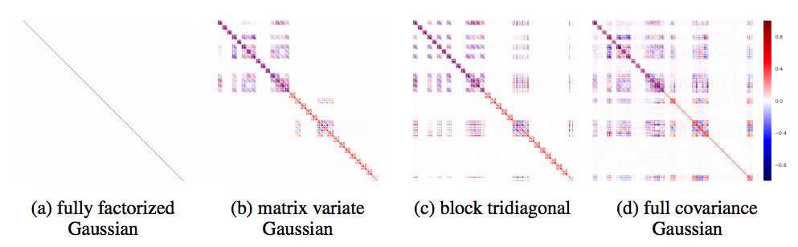
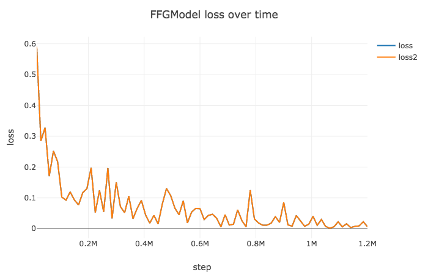
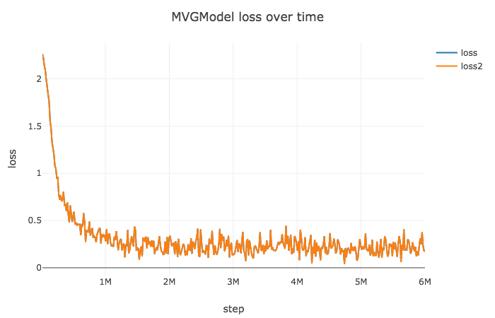

# Noisy Natural Gradient as Variational Inference

PyTorch implementation of [Noisy Natural Gradient as Variational Inference](https://arxiv.org/pdf/1712.02390.pdf).

## Requirements

- Python 3
- Pytorch
- visdom

## Comments
- This paper is about how to optimize bayesian neural network which has matrix variate gaussian distribution.
- This implementation contains Noisy Adam optimizer which is for Fully Factorized Gaussian(FFG) distribution, and
Noisy KFAC optimizer which is for Matrix Variate Gaussian(MVG) distribution.
- These optimizers only work with bayesian network which has specific structure that I will mention below.
- Currently only linear layer is available.

## Experimental comments
- I addded a lr scheduler to noisy KFAC because loss is exploded during training. I guess this happens because of slight approximation.
- For MNIST training noisy KFAC is 15-20x slower than noisy Adam, as mentioned in paper.
- I guess the noisy KFAC needs more epochs to train simple neural network structure like 2 linear layers.

## Usage

Currently only MNIST dataset are currently supported, and only fully connected layer is implemented.

### Options
- `model` : Fully Factorized Gaussian(`FFG`) or Matrix Variate Gaussian(`MVG`)
- `n` : total train dataset size. need this value for optimizer.
- `eps` : parameter for optimizer. Default to 1e-8.
- `initial_size` : initial input tensor size. Default to 784, size of MNIST data.
- `label_size` : label size. Default to 10, size of MNIST label.

More details in [option_parser.py](https://github.com/wlwkgus/NoisyNaturalGradient/blob/master/option_parser.py)

### Train
    $ python train.py --model=FFGModel --batch_size=100 --lr=1e-3 --dataset=MNIST
    $ python train.py --model=MVGModel --batch_size=100 --lr=1e-2 --dataset=MNIST --n=60000

### Visualize
- To visualize intermediate results and loss plots, run `python -m visdom.server` and go to the URL http://localhost:8097

### Test
    $ python test.py --epoch=20

## Training Graphs

### 1. MNIST
- network is consist of 2 linear layers.
- FFG optimized by noisy Adam : `epoch` 20, `lr` 1e-3

- MVG optimized by noisy KFAC : `epoch` 100, `lr` 1e-2, decay 0.1 for every 30 epochs
- Need to tune learning rate.

## Implementation detail
- Optimizing parameter procedure is consists of 2 steps, `Calculating gradient` and `Applying to bayeisan parameters`.
- Before forward, network samples parameters with means & variances.
- Usually calling step function updates parameters, but not this case. After calling step function, you have to update bayesian parameters. Look at the [ffg_model.py](https://github.com/wlwkgus/NoisyNaturalGradient/blob/master/models/ffg_model.py)

## TODOs
- More benchmark cases
- Supports bayesian convolution
- Implement Block Tridiagonal Covariance, which is dependent between layers.

## Code reference

Visualization code(visualizer.py, utils.py) references to pytorch-CycleGAN-and-pix2pix(https://github.com/junyanz/pytorch-CycleGAN-and-pix2pix) by [Jun-Yan Zhu](https://github.com/junyanz)

## Author

[Tony Kim](https://github.com/wlwkgus)
